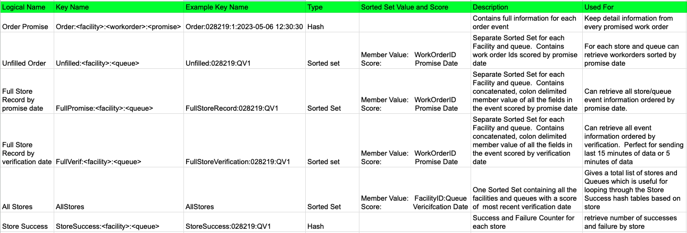

# redisPromiseTime
Tracks success based on promise time compared with verification time at facilities

## Outline

## Overview
Tracks success based on promise time compared with verification time at facilities using a redis streams producer and a consumer.
Solution using java spring boot leverage redis hash and redis sorted sets to arrive at a success metrics per store and queue.  
The producer and the consumer share a common record structure to hold the events.

These are the data structures used


## Important Links/NotesLinks
* [Stream Processing with Redis and Spring Boot Data Blog](https://howtodoinjava.com/spring-data/redis-streams-processing/)
* [Majority of this code stolen from here](https://github.com/lokeshgupta1981/Spring-Boot-Examples/tree/master/spring-redis-streams)
* [Instructive spring boot overview](https://howtodoinjava.com/spring-data/spring-boot-redis-with-lettuce-jedis/)
* [redis stack](https://developer.redis.com/create/redis-stack)
* [redis sorted sets](https://redis.io/docs/data-types/sorted-sets/)

# Instructions
### Create environment
Clone the github
```bash 
get clone https://github.com/jphaugla/redisPromiseTime.git
```
### Start redis with docker
```bash
docker-compose up -d 
```
### Build application
```bash
mvn clean package
```

### Starting the application

* Start the consumer in one terminal session
```bash
cd stream-event-consumer
java -jar target/stream-event-consumer-0.0.1-SNAPSHOT.jar
```
* Start the producer in a different terminal session
```bash
cd stream-event-producer
java -jar target/stream-event-producer-0.0.1-SNAPSHOT.jar
```

### Using the application
A scripts directory has two subdirectories:  consumer, producter

#### producer
The scripts here produce records.  A basic workflow starts with a promise record with no verification date and continues 
with the fulfillment of this promise record.  Will see the unfilled order data structure after the promise record be removed
when the fulfillment occurs.
```bash
cd producer
./orderNull.sh
# observer structures using redisinsight before running fulfillment
./orderFulfilled.sh
```
Continue by populating additional records
```bash
./sameStore.sh 
./multipleOrders.sh
```

#### consumer
The scripts provide interface to retrieve answers from the generated data
```bash
# check status 
./status.sh
# get status of one store
./getStoreStatus.sh
# get all store status statistics
./getAllSstoreStatus.sh
```

Obser

